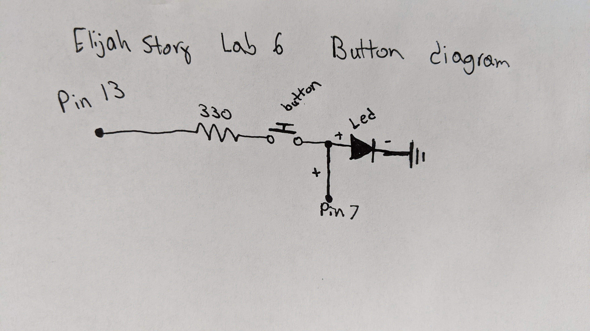

# Lab6-Elijah-Story
 
## #1
This is a link to a video of the arduino running off of wall power. It is running the blinking led code.
[Wall powered video](https://photos.app.goo.gl/CHZoEDzRAf6q8swK9)

## #2
- We use resistors to reduce the flow of current through a circuit.
- Because the resistor reduces the flow of current, the light an LED produces becomes dimmer.
- Orange, orange, black, black, brown
- Here is a video of the blinking code with a 330 ohm resistor. [330 resitor](https://photos.app.goo.gl/ZR5wpno869bxR38Q9)

## #3
- Here is a video of the LED turning on and off with a button press. [Button LED](https://photos.app.goo.gl/QXfSZPQydxC5HqB19)
- Below is a diagram of the wiring for the button press circuit.

## #4
- Below is my plan for a lantern. I am going to use paper mache to cover a balloon to form a cover for the LED and wiring. I am using tissue paper to keep the walls thin for the light to pass through.

